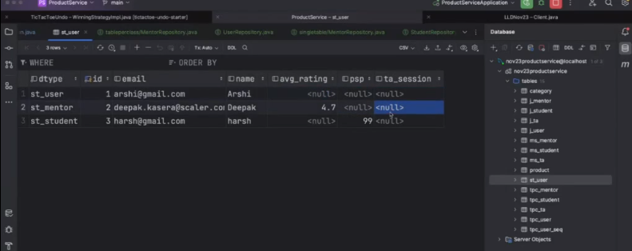

1. create the project with spring intialiser and choose the maven
2. As the depenedency resolver
3. now create the models
4. create base class and other modeles
5. now create controllers
6. now map the controller with end point
7. mapping with all the CRUD operation controller services
8. @Service will create object of a class using constructor and store ( we will create
9. constructor / object for class which has implement the interface not the actual interface
10. as we know that interface have no object)
11. in ApplicationContext initialiser
12. in beans during run you will find all the object created by @service annotation
13. NOTE: WE HAVE TO GIVE A BEAN NAME EACH SERVICE CLASS WHEN IMPLEMENTED VIA INTERFACE
14. AND PASSED THE BEAN NAME WHEN CALL FROM THE CONTROLLER
15. @Qualifier("fakeStoreProductService") is defined that which service object we need in controller
16. RestTemplate restTemplate = restTemplateBuilder.build(); // TODO: BUILDER DESGIN PATTERN NOTE THIS METHOD USE BUILDER DESIGN PATTERN
17. create a controller service"@ControllerAdvice "which will handle all the exception from the all the class
18. and in this above class we will handle different type of handler method for each specific class
19. @ExceptionHandler(ProductNotFoundException.class)
     @ResponseStatus(HttpStatus.NOT_FOUND) // this will change the status code of the exception
    @ResponseBody() // this will help to give what we just send value in the body not other traces
20. if you deLombok the @GETTER then it will replace the code behind it was implemented and like wise others methods also
21. @Data ,@Builder @AllArgConstruct all are essentiall lomvok method use

23. CLASS: Finishing API's

             CREATE  a class to integrating third party Api like adaptor design pattern but as an class not interface
            Create application.property key value pair and use in place of url with @value annotation and pass the value to constructor
            to initialise the things 
            change server port 
            Read protobuf inplace serialisation and deserialisation
    28.  
        29. CLASS: Advanced Database Operations and DB Migrations
           
                 {Spring JPA, Sql connector, dendency in pom, cardinality between table, reserved key word Error resolved"
                NOTE 39 : CARDINALITY BTWN PRODUCT AND CATEGORY
                 1 -->   1
                 PRODUCT  :  CATEGORY
                 M    <-- 1
30. CLASS : Database Queries, Inheritance & Relations
    
        Inheritance of db single table, join table, table per class, mappedSuperclas
        @Qualifier = for mentioned/point out a  particular class using named inside its parameter
        @Repository = to defined a class that is a repository which will connect to JPA for connectiong database
        @PrimaryKeyJoinColumn(name = "user id")//NOTE 49 : this is used fir join between user table
        @GeneratedValue(strategy = GenerationType.AUTO)// generated incremental id
        @MappedSuperclass // NOTE 36 : passed the attribute to the child class
        @Inheritance(strategy = InheritanceType.JOINED)//strategy of inheritance is table per class
        @GeneratedValue(generator = "uuidGenerator") // OWN GENERATOR
        @Column(name = "id",columnDefinition = "binary(16)",nullable = false,updatable = false)
        // use coloumn name and binary 16B format with not nullable and not updatable UUID as it is primary key
        ManyToOne private Category category; // DERIVED ATTRIBUTE AND NEED TO CARDINALITY WITH PRODUCT

31.CLASS : Database - Cardinalities & N+1 problem
       
           
          

   
    

32. Class Spring Cloud - Discovery Service & API GW
33. if we need to connect with One Microservice with another service then following step should be follow
34. 1. run Service Discovery Microservice and also run all the instances of two other microservices
35. 2. now create a function let say here product service will call UserService so
36.     prodcut service will write a method to call the user service by Resttemplate with the Url passing to 
37.     the user service like  this   http://localhost:4040/users/1
         GenericProductDto genericProductDto = new GenericProductDto();
            RestTemplate restTemplate = new RestTemplate();
            ResponseEntity<UserDto> userDtoResponseEntity = restTemplate.getForEntity("http://localhost:4040/users/1", UserDto.class);
    3. now call the endpoint of product service like where above code is implemented and get the response if everything was good
    4. 
            return genericProductDto;
32. // Three way of Dependency Injection
33. Constructor injection // MOST USED AS WE HAVE IMPLEMENTED IN THE PRODUCT CONTROLLER
34. Field Injection  // NOT RECOMENDEND USING @AUTOWIRED
35. Setter Injection

